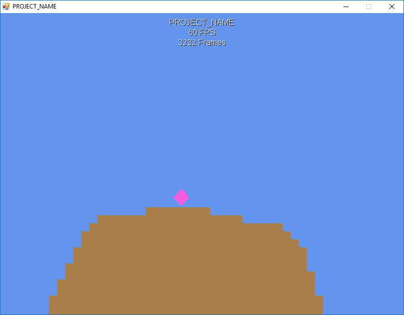

Protogame "Platformer" Template
================================

## **❗❗❗ Protogame has been sunset as of 1st Jan 2018 and is no longer supported or maintained. Please read the announcement for more information: [Sunsetting Protogame](https://medium.com/redpoint/sunsetting-protogame-a18e1f03af43). ❗❗❗**

This template implements a basic 2D platformer in Protogame.  It covers the following topics:

- How to create non-componentized entities
- How to play audio
- How to perform collision detection and movement in a platformer
- How to load Ogmo editor levels
- How to bind events to actions
- How to implement the spawner pattern

Getting Started
------------------

This template is available in the Protobuild Manager, which provides a graphical interface to create projects.

Alternatively, you can create this template from the command-line with:

```
Protobuild.exe --start https-git://www.github.com/RedpointGames/Protogame.Template.Platformer
```

Just download [Protobuild.exe](https://github.com/Protobuild/Protobuild/raw/master/Protobuild.exe) and place it in an empty folder where you want to create your project.

Screenshot
--------------


